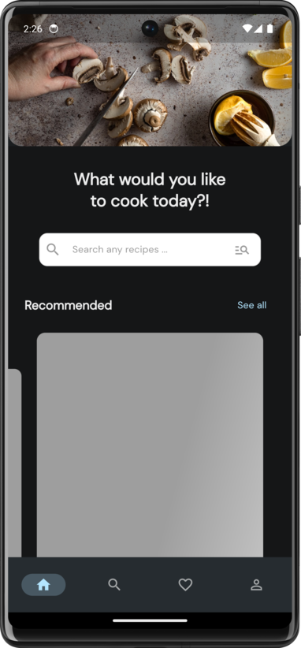
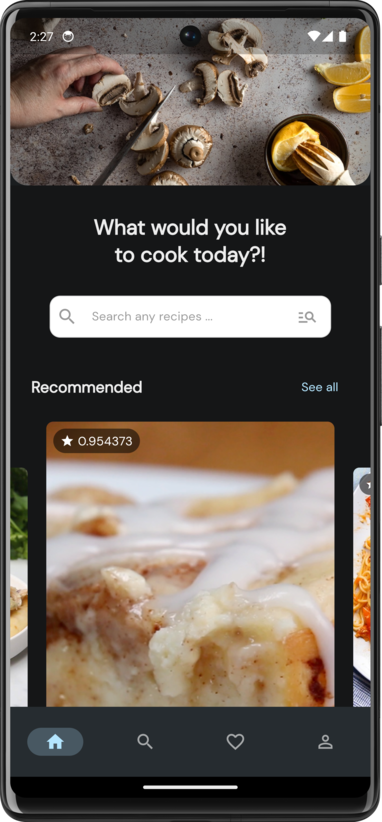
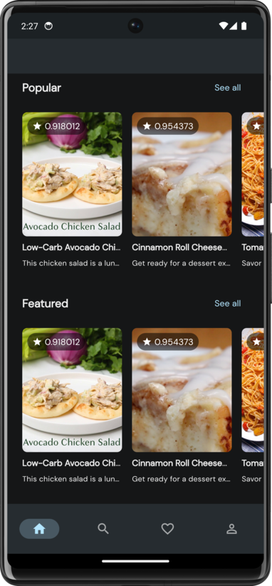
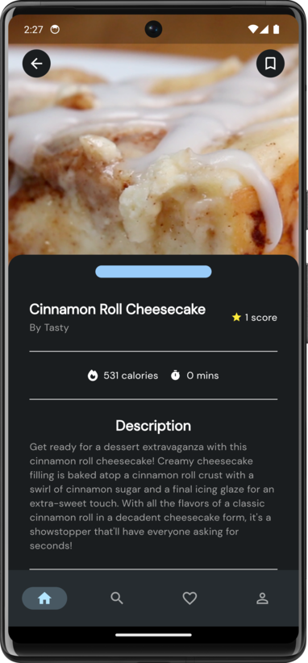
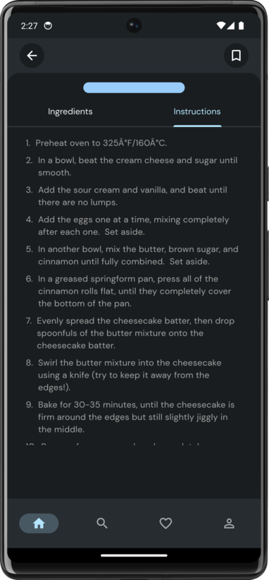
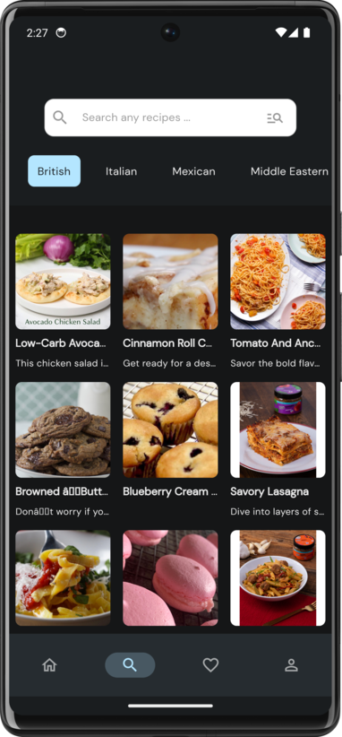
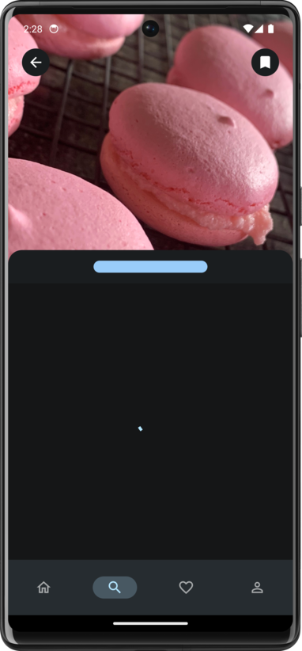
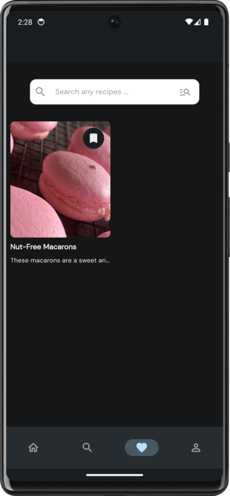
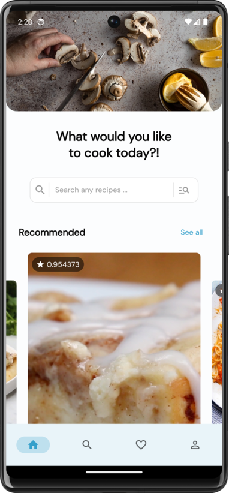
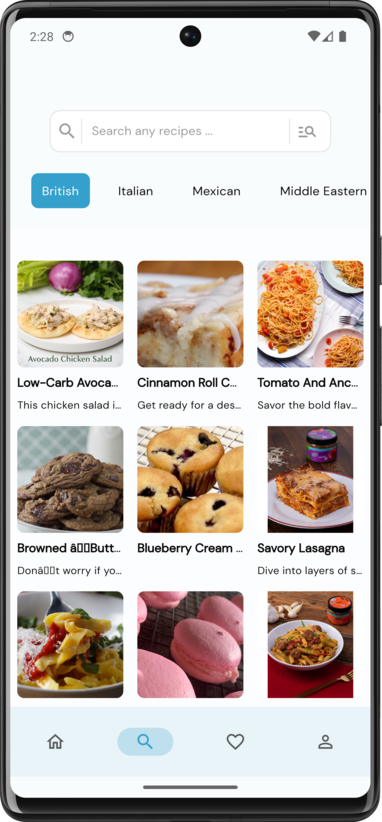

# RecipeRift

# Screenshots

# Dependencies

cached_network_image, carousel_slider, connectivity_plus, dartz, dio, flex_color_scheme, flutter_animate, flutter_hooks, font_awesome_flutter, freezed_annotation, go_router, google_fonts, hooks_riverpod, http, json_annotation, riverpod_annotation, shared_preferences

# Dev Dependencies

build_runner, flutter_lints, freezed, json_serializable, riverpod_generator
